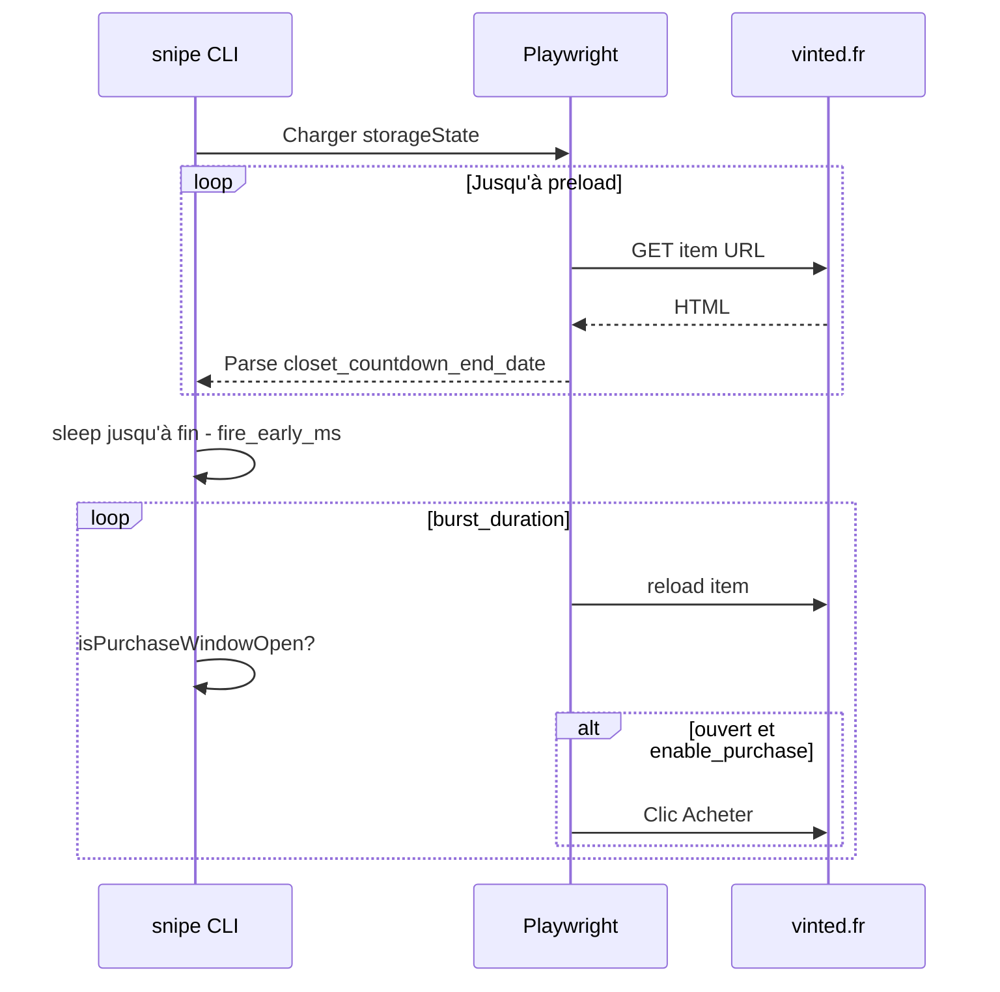

# Architecture

## Stack

| Couche | Choix |
|--------|--------|
| Runtime | Node.js 20+, TypeScript |
| Automatisation | Playwright (Chromium) |
| Config | `config.yaml` + `.env` (dotenv) |
| Validation | Zod |

## Flux principal (`npm run snipe`)

## Modules

- `src/config.ts` — fusion YAML / env.
- `src/vinted/itemPageState.ts` — extraction HTML du plugin `buy`.
- `src/vinted/purchase.ts` — clic Acheter + contrôles prix.
- `src/snipe/runSnipe.ts` — boucle temporisation et burst.

## Données sensibles

- `data/auth-state.json` : cookies de session — **gitignore**, chmod 600 recommandé.
- Ne jamais committer `.env`.

## Limites connues

- API `/api/v2/items/:id` souvent bloquée (403) sans session navigateur → parsing HTML uniquement.
- Structure HTML Vinted susceptible de changer → parser défensif + regex de secours.
- Pas d’API d’achat publique ; checkout et SCA restent côté navigateur.
